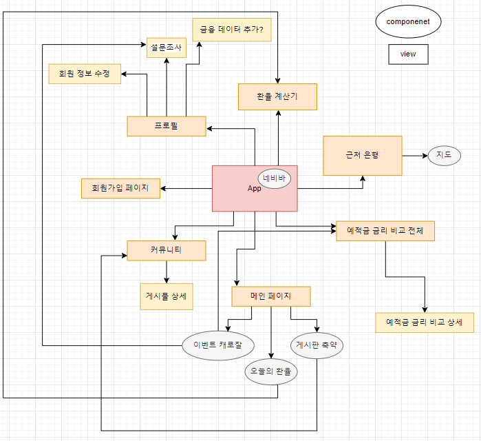
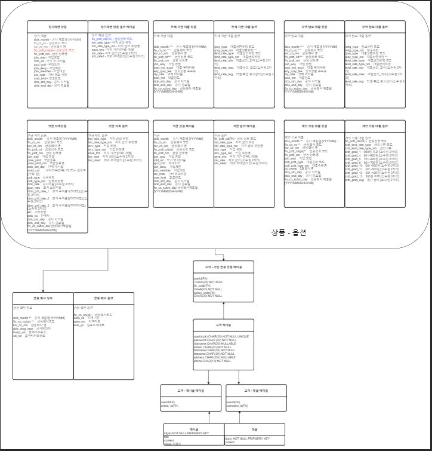
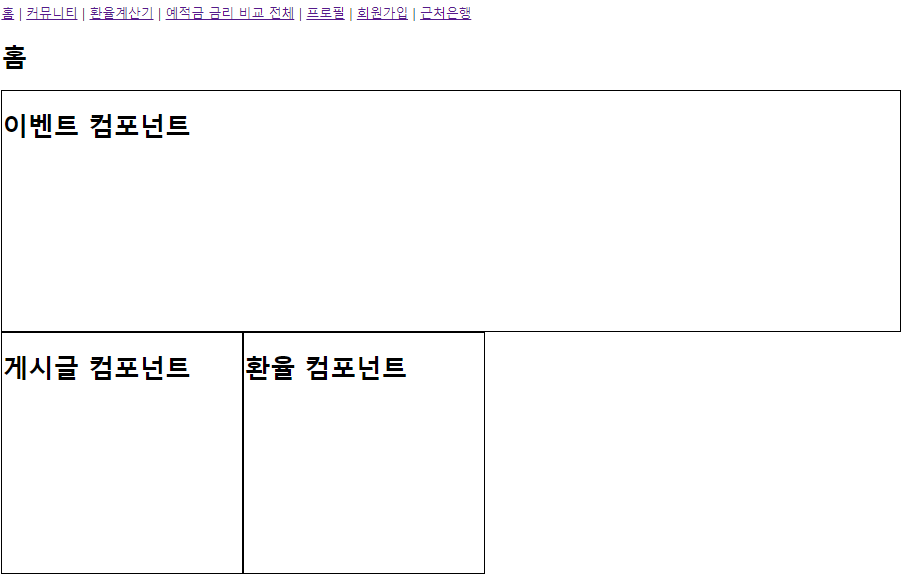

# 11/16
## 진행 상황
1. 컴포넌트 관계도 작성

2. ERD 작성

3. django 유저 모델 만들기
4. vue 초기 화면 만들기

5. 기초 회원가입 툴 만들고 회원가입 완료
## 어려웠던 점
1. API를 통해 가져올 데이터들을 저장하기 위한 테이블 선언을 위해 models를 만들때, 모델 선언시 필드 값을 정하는 것에 어려움을 겪었다.
2. 각 components와 views의 관계도를 작성할 때 어떻게 작성해야 깔끔하게 정리 될까 고민하는게 어려웠다.
3. django에서 REST API를 통해 기본적으로 제공 되는 템플릿을 이용하려고 했으나, 500 error 가 발생하여 접근하지 못했었다.
4. 처음 프로젝트 진행했을 때, 도저히 알 수 없는 에러가 계속 나와서 진행이 불가능해서 처음부터 다시 시작했다. 처음 진행했을 당시 여러 코드를 가져와 사용했었는데 적용이 제대로 되지 않아서 에러가 발생한 것 같았다.
## 오늘 알게된 점
1. installapps를 작성할때, 앱의 순서도 오류에 영향을 준다는 것을 알게되었다. 교안만을 보며 진행하지 말고, 각 라이브러리의 documentation을 보며 차근차근 설치해야 한다.
오늘은 installapps의 순서와 dj-allauth의 middleware 관련 구절을 제외하여 오류가 해결되었다. (버전 문제인 것으로 생각됨)
- 참고
  - [dj-rest-auth](https://github.com/iMerica/dj-rest-auth)
  - [dj-allauth](https://docs.allauth.org/en/latest/installation/quickstart.html)

2. 한 프로젝트에서 models를 만들 때 기존에 배운것과 같이 모델을 한 두개만 만들지 않으면 너무 많아서 프로젝트 진행에 문제점이 될 줄 알았다. 금융 상품의 json 구조가 너무 달라 하나의 모델로 통합 할 수 없을 것 같아 적은 모델로 해결하지 못해 고민하였다. 하지만 모두 다른 모델로 구성하여 관리하는 것이 효율적이라는 것을 알게되었다.

## 역할
- 김영준 : accounts 앱 빌딩, django 기본 세팅, 회원가입 django 기능 구현
- 윤예빈 : 컴포넌트 관계도 작성, ERD 구성도 작성, 회원가입 Vue 기능 구현

# 11/17
## 오늘 알게된 점
1. params로 들어온 id 값은 string타입이라서 엄격한 비교(===)를 사용하면 값이 같이 않다고 인식된다. 따라서 형변환을 실행해주거나 유형변환 비교를 실행해야한다.
2. filter의 반환값은 배열이다.
3. javascript에서 type 유형 확인하는 법 = typeof 였다.

- 김영준 : 로그인 django 기능 구현, 커뮤니티 기능 구현
- 윤예빈 :  로그인 Vue 기능 구현, 커뮤니티 컴포넌트 구현
